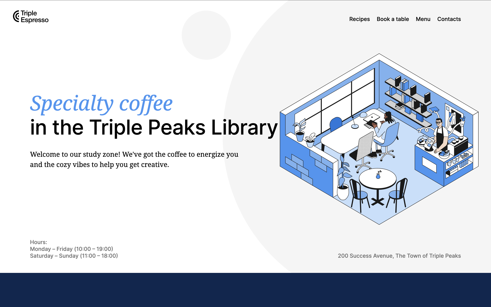
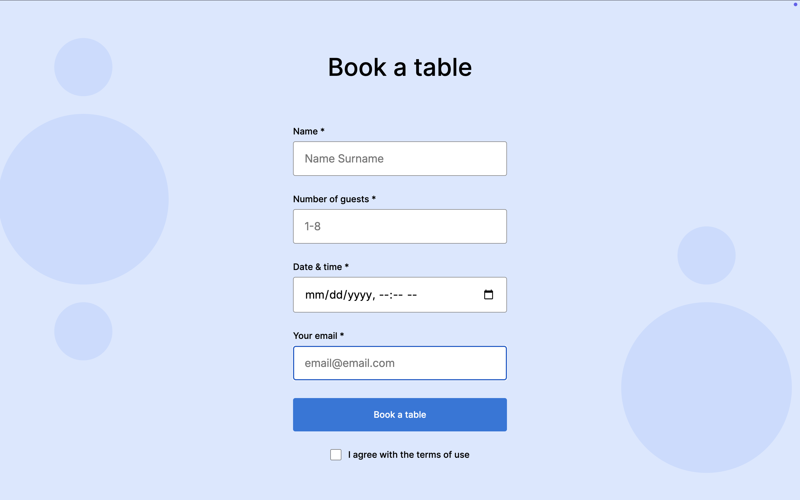
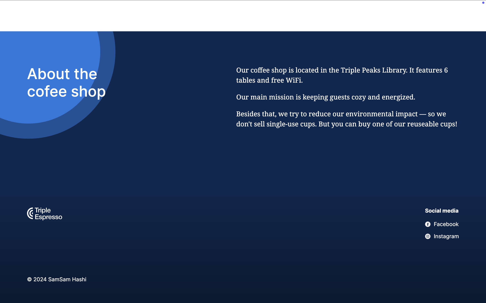

# Specialty Coffee In The Triple Peaks Coffee Shop

This is the second project of the Software Engineering program at TripleTen. It was developed using HTML and CSS, based on the design brief.

## Table of Contents

- [Project Description](#project-description)
- [Project Features](#project-features)
- [Plan on Improving the Project](#plan-on-improving-the-project)
- [Screenshots](#screenshots)
- [Live Demo](#live-demo)
- [Deployment Instructions](#deployment-instructions)
- [System Requirements](#system-requirements)

## Project Description

This project is a coffee shop landing page designed to showcase a variety of web development techniques. It was developed using semantic HTML and CSS, implementing key elements such as:

- Headings
- Lists
- Links
- Custom forms

## Project features

- Semantic HTML5
- Flexbox
- Positioning
- Flat BEM file structure
- A custom form
- CSS animation and transform

## Plan on improving the project

- Fix the menu section's inconsistent background using the same background image as the header to create a more cohesive visual design.
- Enhance the page using additional CSS animations and transitions to make the site more dynamic and interactive.

## Screenshots

## Homepage



## Reservation Section



## Footer



## Live Demo

You can access the live version here:

[Live Demo](https://samjamhas10.github.io/se_project_coffeeshop/)

## Deployment Instructions

To run the project locally:

1. Clone the repository:

   ```bash
   git clone https://github.com/samjamhas10/se_project_coffeeshop.git
   ```

2. Navigate to project directory:

   cd se_project_coffeeshop

3. Open the index.html file in your browser

## System Requirements

This project is a front-end single-page web application. There are no special dependencies, and it can be used with the following web browsers:

- Chrome
- Firefox
- Safari
